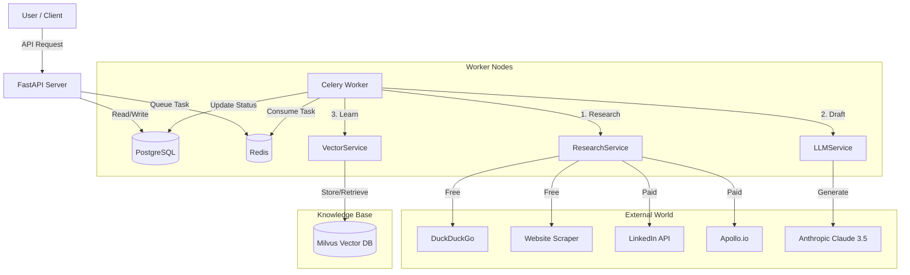

# AIDEN Server

**AIDEN** is an autonomous, AI-powered Sales Development Representative (SDR) agent backend. It automates the entire outbound sales workflow: from deep prospect research and hyper-personalized email drafting to managing multi-touch sequences and learning from successful interactions.

---

## 🏗️ Architecture

AIDEN follows an asynchronous, event-driven architecture designed for scalability and resilience.



---

## 🚀 Features

### Phase 1: Core Foundation
*   **Prospect Management**: CRUD operations for prospects with status tracking (`NEW`, `RESEARCHED`, `DRAFTED`).
*   **Async Task Engine**: Robust Celery + Redis setup to handle long-running research jobs.
*   **LLM Integration**: Mock integration with Anthropic (Claude 3.5) for email generation.

### Phase 2: Sequences & Integrations
*   **Campaigns & Sequences**: Support for multi-step outreach campaigns (`SequenceStep`).
*   **Real Data Enrichment**: Integration with **Apollo.io** (enrichment) and **Proxycurl** (LinkedIn scraping).
*   **Resilience**: Global exception handling, structured logging, and task retries with backoff.

### Phase 3: Intelligence & Cost Optimization
*   **Waterfall Research**: Cost-effective strategy that prioritizes free sources first:
    1.  **DuckDuckGo**: Find LinkedIn URLs and Company News.
    2.  **Web Scraper**: Extract text from company homepages (`httpx` + `BeautifulSoup`).
    3.  **Premium Fallback**: Only calls paid APIs (Proxycurl/Apollo) if critical data is missing.
*   **Vector Memory (RAG)**: Integration with **Milvus** to store embeddings of successful emails, enabling "Few-Shot" learning for future drafts.

---

## 🛠️ Tech Stack

*   **Framework**: FastAPI (Python 3.12)
*   **Database**: PostgreSQL 15 (Async SQLAlchemy + Alembic)
*   **Task Queue**: Celery + Redis
*   **Vector DB**: Milvus (Standalone)
*   **AI/LLM**: Anthropic API
*   **Harvesting**: DuckDuckGo, BeautifulSoup, Proxycurl, Apollo

---

## ⚡ Setup & Installation

### Prerequisites
*   Python 3.12+
*   Docker & Docker Compose
*   Poetry (Dependency Manager)

### Option 1: Local Development (Lightweight)
Suitable for coding and testing logic without spinning up heavy infrastructure. Uses SQLite.

1.  **Clone & Install**:
    ```bash
    git clone <repo>
    cd apps/aiden-server
    poetry install
    ```

2.  **Configure Environment**:
    ```bash
    cp .env.example .env
    # Edit .env: Ensure DATABASE_URL uses sqlite (default)
    ```

3.  **Run Migrations**:
    ```bash
    poetry run alembic upgrade head
    ```

4.  **Start Services**:
    *   **Redis** (Required for tasks): `docker run -d -p 6379:6379 redis:alpine`
    *   **API Server**: `poetry run uvicorn app.main:app --reload`
    *   **Worker**: `poetry run celery -A app.core.celery_app worker --loglevel=info`

### Option 2: Full Production Stack (Docker)
Runs everything (API, Worker, Postgres, Redis, Milvus) in containers.

1.  **Update Config**:
    Edit `.env` to point to docker service names:
    ```properties
    DATABASE_URL=postgresql+asyncpg://postgres:password@db:5432/aiden
    REDIS_URL=redis://redis:6379/0
    MILVUS_HOST=milvus-standalone
    ```

2.  **Build & Run**:
    ```bash
    docker-compose up --build -d
    ```
    *   API: `http://localhost:8000`
    *   Docs: `http://localhost:8000/api/v1/docs`
    *   Milvus: `localhost:19530`

---

## ⚙️ Configuration

| Variable | Description | Default |
|----------|-------------|---------|
| `DATABASE_URL` | DB Connection String | `sqlite+aiosqlite:///./aiden.db` |
| `REDIS_URL` | Redis Connection | `redis://localhost:6379/0` |
| `MILVUS_HOST` | Vector DB Host | `localhost` |
| `MILVUS_PORT` | Vector DB Port | `19530` |
| `ANTHROPIC_API_KEY` | Claude 3.5 API Key | `None` |
| `APOLLO_API_KEY` | Apollo.io Key | `None` |
| `PROXYCURL_API_KEY` | Proxycurl (LinkedIn) Key | `None` |
| `SENTRY_DSN` | Error Tracking DSN | `None` |

---

## 🧪 Testing

Run the test suite (requires Redis running locally):

```bash
# Install test dependencies
poetry install --with dev

# Run tests
poetry run pytest
```

---

## 🚀 Deployment

The project includes a production-ready `Dockerfile` and `start.sh` script.
*   **Web Server**: Uses `Gunicorn` with Uvicorn workers (`gunicorn_conf.py`).
*   **Migrations**: Automatically runs `alembic upgrade head` on container start.
*   **Logging**: structured JSON logging configured in `app/core/log_config.py`.
